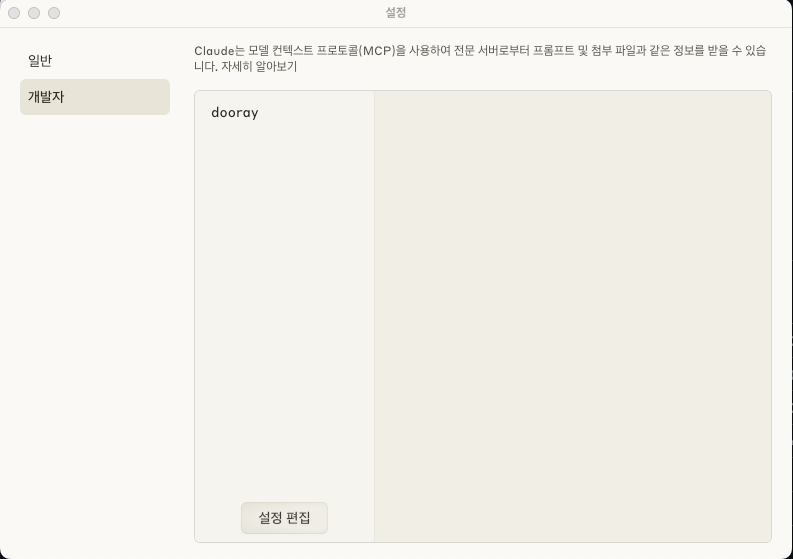
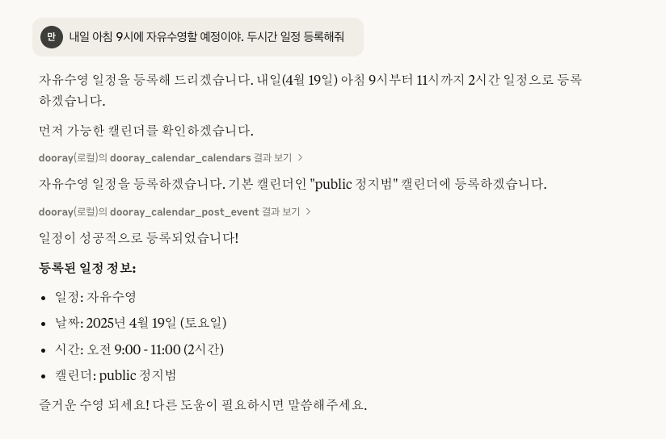

# dooray_mcp
* Dooray! MCP 서버 입니다. 
* 지금은 메신저 보내기, 캘린더 조회하기, 일정 등록하기 기능을 사용할 수 있습니다. 

## 설치하기
* 릴리즈에서 PC의 아키텍쳐에 해당하는 바이너리를 다운로드 합니다. 
* https://github.com/dooray-go/dooray_mcp/releases

## 설정하기
* Claude 설치
  * MCP를 지원하는 Claude.ai 데스크탑 애플리케이션을 설치합니다.
  * https://claude.ai/download

* MCP 설정
  * Claude.ai 데스크탑 애플리케이션에서 설정 > 개발자 > 설정 편집 을 선택합니다. 
  
  * 설정파일을 다음과 같이 편집합니다. 
  * claude_desktop_config.json

 ```json
{
    "mcpServers": {
        "dooray": {
            "command": "/Users/nhn/Downloads/dooray.darwin.arm64",
            "args": [
                "--token",
                "{개인토큰}"
            ]
        }
    },
    "globalShortcut": ""
}
```

## 메신저 사용하기
* 이제 Claude.ai 데스크탑 애플리케이션에서 Dooray! MCP 를 사용할 수 있습니다.
* 다음을 Claude.ai 에 말해 보세요.
```shell
오늘 내 일정을 중요한 순으로 정렬해서 김XX 에게 메신저로 보내 줘.
```

## 캘린더 사용하기
```
내일 일정 중에 중요한 일정은 뭐야?
```
```
내일 아침 9시에 자유수영 할 예정이야. 두시간 일정 등록해줘.
```

