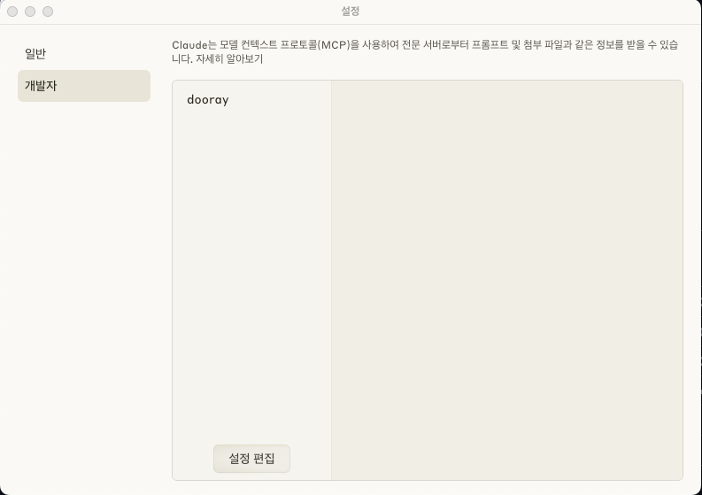
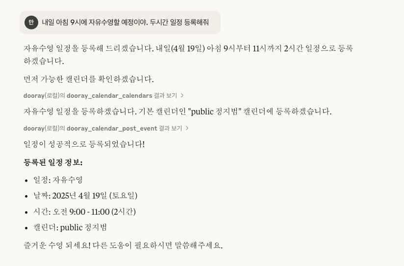

# dooray_mcp
* Dooray! MCP 서버 입니다. 
* 지금은 메신저 보내기, 캘린더 조회하기, 일정 등록하기 기능을 사용할 수 있습니다. 

## 설치하기

### Homebrew (macOS / Linux)

```bash
brew tap dooray-go/tap
brew install dooray-mcp
```

설치 후 `dooray-mcp` 명령어를 사용할 수 있습니다.

### 직접 다운로드
릴리즈에서 PC의 아키텍쳐에 해당하는 바이너리를 다운로드 합니다.
* https://github.com/dooray-go/dooray_mcp/releases

## 설정하기

### Claude Desktop 에서 사용하기
* Claude 설치
  * MCP를 지원하는 Claude.ai 데스크탑 애플리케이션을 설치합니다.
  * https://claude.ai/download

* MCP 설정
  * Claude.ai 데스크탑 애플리케이션에서 설정 > 개발자 > 설정 편집 을 선택합니다.
  
  * 설정파일을 다음과 같이 편집합니다.
  * claude_desktop_config.json

 ```json
{
    "mcpServers": {
        "dooray": {
            "command": "dooray-mcp",
            "args": [
                "--token",
                "{개인토큰}"
            ]
        }
    },
    "globalShortcut": ""
}
```
  > Homebrew로 설치한 경우 `dooray-mcp`를 그대로 사용합니다. 직접 다운로드한 경우 바이너리의 전체 경로를 입력하세요.

### Claude Code (CLI) 에서 사용하기

Claude Code 에서 MCP 서버를 등록하면 터미널에서 바로 Dooray 기능을 사용할 수 있습니다.

1. MCP 서버 등록 (프로젝트 단위)
```bash
claude mcp add dooray -- dooray-mcp --token {개인토큰}
```

2. 전역으로 등록하려면 `-s user` 옵션을 추가합니다.
```bash
claude mcp add --scope user dooray -- dooray-mcp --token {개인토큰}
```

3. 등록 확인
```bash
claude mcp list
```

등록 후 Claude Code 에서 바로 사용할 수 있습니다.
```bash
claude "오늘 내 캘린더 일정을 알려줘"
```

## 메신저 사용하기
* 이제 Claude.ai 데스크탑 애플리케이션에서 Dooray! MCP 를 사용할 수 있습니다.
* 다음을 Claude.ai 에 말해 보세요.
```shell
오늘 내 일정을 중요한 순으로 정렬해서 김XX 에게 메신저로 보내 줘.
```

## 캘린더 사용하기
```
내일 일정 중에 중요한 일정은 뭐야?
```
```
내일 아침 9시에 자유수영 할 예정이야. 두시간 일정 등록해줘.
```




## 두레이 업무 사용하기
```
나는 정만티야 Dooray-잘쓰자 프로젝트에서 가장 급한일을 알려줘
```
